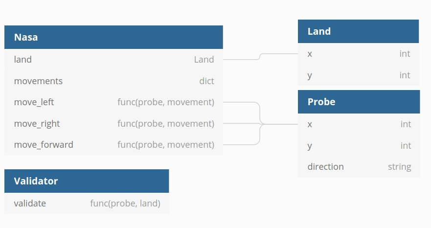

# Explorando Marte

## IMPLEMENTAÇÃO

A solução foi modelada minimamente de forma a não tornar a implementação tão complexa seguindo o diagrama abaixo:



As classes **Land** e **Probe** fazem parte do pacote de modelos e identificam a superfície de marte (o planalto) e a sonda, respectivamente.

Essas classes não possuem comportamentos dentro delas, mas quando compostas em outras, são gerenciadas a fim de atingir o objetivo do problema proposto.

A classe **Nasa** é a principal classe do sistema e é responsável por controlar a sonda e realizar as movimentações sob o planalto.

A classe **Validator** é simplesmente uma classe auxiliar para facilitar as validações que possam ser utilizadas após uma movimentação de sonda. Atualmente, a única validação que está sendo realizada é se a sonda ultrapassou os limites do planalto, mas essa classe permite facilmente uma expansão para futuras validações.

Abaixo encontra-se a divisão da solução em seus devidos pacotes.

```
├── controller
│   ├── __init__.py
│   └── nasa.py
├── helpers
│   ├── __init__.py
│   └── validator.py
├── inputs
│   └── 1.txt
├── model
│   ├── __init__.py
│   ├── land.py
│   └── probe.py
├── __init__.py
├── main.py
└── test
    ├── __init__.py
    ├── test_main.py
    └── test_nasa.py
```

Os pacotes **controller**, **helpers** e **model** já foram mencionados anteriormente. Vale à pena apenas salientar o pacote de **test** que comporta as classes que realizam os testes unitários da solução.

## SUPOSIÇÕES

### A Sonda não pode ultrapassar os limites do planalto
Um planalto possue suas coordenadas máximas indicadas pelos seus atributos x e y. Onde **y** denota o limite superior da coordenada vertical e **x** o limite superior da coordenada horizontal.

Qualquer movimentação da sonda que ultrapasse tando os limites superiores quanto os inferiores (i.e. 0), resultará em um **Warning** escrito na tela e a impossibilidade da execução do movimento, mantendo a sonda do mesmo local.

### Inputs serão sempre os esperados
Foi suposto que os inputs tanto de localização quanto de movimentação serão dos tipos previstos e pertencerão ao conjunto de dados esperados. 

## COMO EXECUTAR
Para executar o programa, bastar ter o python na versão *3.8.2* e executar o comando a seguir na raiz da aplicação:

```console
python main.py
```
E preencher os inputs como desejado:
```
5 5
1 2 N
LMLMLMLMM
```
A saída retornará algo como:

```
1 3 N
```
E continuará a espera do input para a próxima sonda. Para finalizar o programa, basta digitar o atalho que indica **EOF (End Of File)** Ctrl+D no Linux, Ctrl+Z no Windows e ⌘+D no OSX.

Também existe a possibilidade de receber um arquivo como parâmetro, para isso execute:

```
python main.py < inputs/1.txt
```
A saída será:

```
1 3 N
5 1 E
```

## TESTES UNITÁRIOS

Os testes unitários que foram escritos na aplicação podem ser executados pelo comando:

```
python -m unittest
```

Esse comando também encontra-se na pipeline a ser executado assim que um novo código entra na branch master do repositório.